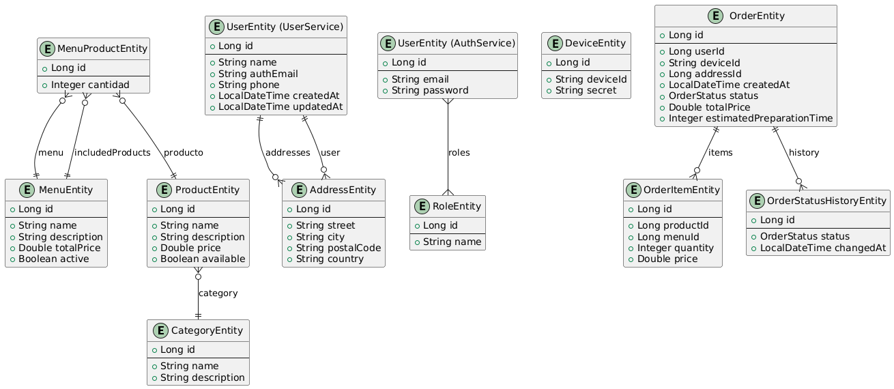
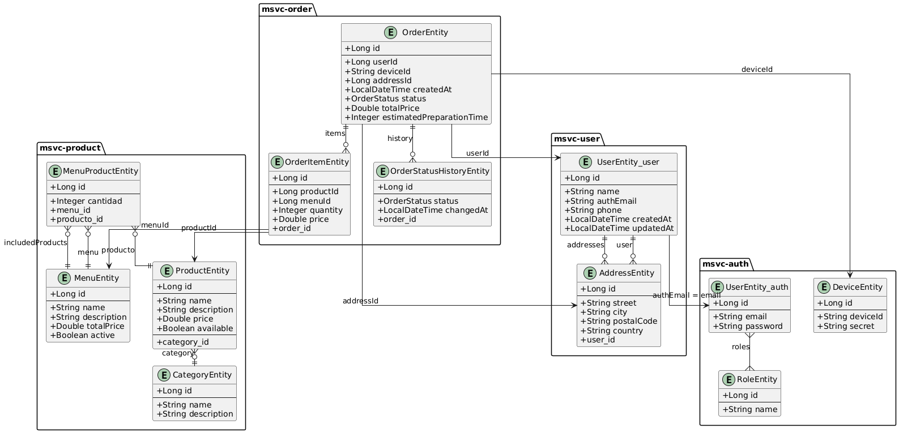

## 04 - Estructura de base de datos

Este documento describe la estructura de datos distribuida entre los distintos microservicios del sistema. Cada microservicio mantiene su propia base de datos con sus entidades y relaciones internas, lo que permite la independencia, escalabilidad y separación de responsabilidades propia de una arquitectura de microservicios.

---

### Estrategia general

* **Modelo por microservicio:** Cada microservicio posee su propia base de datos (una base por dominio), lo que permite independencia total entre ellos.
* **Persistencia:** Se utiliza Spring Data JPA con Hibernate y MySQL.
* **Migración:** No se emplea Flyway ni Liquibase; los esquemas se crean automáticamente por JPA o desde `import.sql`.
* **Comunicación entre dominios:** Las relaciones entre microservicios (ej. `order.userId` → `user-service`) se resuelven vía Feign o eventos, no con claves foráneas.

---

### Descripción por microservicio

#### `msvc-product`

* **Entidades:**

  * `Category`: Categoría de productos.
  * `Product`: Producto individual que pertenece a una `Category`.
  * `Menu`: Menú compuesto por varios productos mediante la relación `MenuProduct`.
  * `MenuProduct`: Entidad intermedia para la relación muchos a muchos entre `Menu` y `Product`.

#### `msvc-user`

* **Entidades:**

  * `User`: Usuario final con email (vinculado al auth).
  * `Address`: Dirección postal de usuario.

#### `msvc-auth`

* **Entidades:**

  * `User`: Email y contraseña de autenticación.
  * `Role`: Permisos asociados.
  * `Device`: Dispositivo registrado.
  * Relación muchos a muchos entre `User` y `Role`.

#### `msvc-order`

* **Entidades:**

  * `Order`: Pedido generado por un usuario.
  * `OrderItem`: Productos o menús incluidos.
  * `OrderStatusHistory`: Historial de cambios de estado de la orden.

---

### Relaciones entre microservicios (a nivel lógico)

* `order.userId` → `user-service.User.id`
* `order.addressId` → `user-service.Address.id`
* `order.deviceId` → `auth-service.Device.deviceId`
* `order.items.productId` → `product-service.Product.id`
* `order.items.menuId` → `product-service.Menu.id`

---

### Diagrama UML

#### Diagrama UML sin cruzar

Este diagrama representa la estructura **interna de cada microservicio** sin relaciones externas entre dominios. Es ideal para visualizar las relaciones estrictamente dentro de la base de datos local de cada servicio.

#### Diagrama UML cruzado

Este diagrama muestra las **relaciones lógicas entre servicios** como si fueran claves foráneas, pero solo a nivel conceptual. Sirve para comprender la dependencia funcional entre microservicios, aunque no existan constraints en base de datos.

---

### Consideraciones

* Las relaciones entre microservicios están normalizadas y desacopladas.
* No se permite acceso cruzado a otras bases de datos.
* La integridad entre servicios se asegura a nivel de código (validaciones, Feign clients, eventos).

