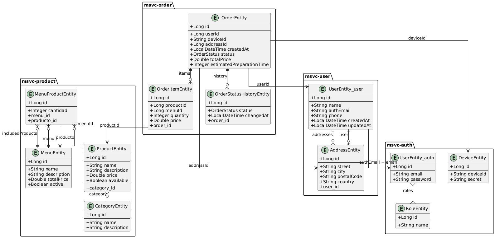

## Índice

* [00 - Introducción a Kizuna Gourmet (TFG)](#00---introducción-a-kizuna-gourmet-tfg)
* [01 - Stack Tecnológico del Proyecto](#01---stack-tecnológico-del-proyecto)

  * [Backend](#backend)

    * [Tecnologías clave](#tecnologías-clave)
    * [Detalles adicionales](#detalles-adicionales)

      * [Descubrimiento de servicios](#descubrimiento-de-servicios)
      * [Configuración externa](#configuración-externa)
      * [Seguridad](#seguridad)
      * [Comunicación entre servicios](#comunicación-entre-servicios)
      * [Persistencia](#persistencia)
      * [WebSocket](#websocket)
      * [Despliegue](#despliegue)
  * [🐋 Infraestructura y despliegue con Docker](#-infraestructura-y-despliegue-con-docker)

    * [Estructura General del `docker-compose.yml`](#estructura-general-del-docker-composeyml)
    * [Base de datos unificada](#base-de-datos-unificada)
    * [Dockerfile común de microservicios de entidad](#dockerfile-común-de-microservicios-de-entidad)
    * [Script de espera `wait-for.sh`](#script-de-espera-wait-forsh)
    * [Script especial de espera para Gateway](#script-especial-de-espera-para-gateway)
    * [Comando de arranque global](#comando-de-arranque-global)
  * [Stack Tecnológico - Frontend](#stack-tecnológico---frontend)

    * [Framework y herramientas principales](#framework-y-herramientas-principales)
    * [Persistencia de sesión](#persistencia-de-sesión)
    * [Estructura de carpetas destacadas](#estructura-de-carpetas-destacadas)
    * [Despliegue y entorno](#despliegue-y-entorno)
* [02 - Estructura del Frontend](#02---estructura-del-frontend)

  * [Estructura de carpetas](#estructura-de-carpetas)
  * [Conexión con el backend](#conexión-con-el-backend)

    * [Configuración global de Axios](#configuración-global-de-axios)
    * [Ejemplo de uso: `authApi`](#ejemplo-de-uso-authapi)
  * [Comunicación en tiempo real (WebSocket)](#comunicación-en-tiempo-real-websocket)

    * [Conexión WebSocket modular](#conexión-websocket-modular)
    * [Composables reactivos](#composables-reactivos)
  * [Sistema de rutas y control de acceso](#sistema-de-rutas-y-control-de-acceso)

    * [Estructura del router](#estructura-del-router)
    * [Sistema de guardia de navegación](#sistema-de-guardia-de-navegación)
  * [Sistema de diseño con Vuetify](#sistema-de-diseño-con-vuetify)

    * [Temas personalizados](#temas-personalizados)
    * [Iconos](#iconos)
  * [Gestión de estado con Pinia](#gestión-de-estado-con-pinia)

    * [Configuración global](#configuración-global)
    * [Ejemplo de store: `useProductStore`](#ejemplo-de-store-useproductstore)
* [03 - Estructura de Microservicios](#03---estructura-de-microservicios)

  * [Microservicios principales](#microservicios-principales)

    * [microservice-config](#microservice-config)
    * [microservice-eureka](#microservice-eureka)
    * [microservice-gateway](#microservice-gateway)
  * [microservice-product](#microservice-product)

    * [Modelos principales](#modelos-principales)
    * [Endpoints - microservice-product](#endpoints---microservice-product)
  * [microservice-auth](#microservice-auth)

    * [Modelos principales](#modelos-principales-1)
    * [Endpoints - microservice-auth](#endpoints---microservice-auth)
  * [microservice-user](#microservice-user)

    * [Modelos principales](#modelos-principales-2)
    * [Endpoints - User](#endpoints---user)
    * [Endpoints - Address](#endpoints---address)
  * [microservice-order](#microservice-order)

    * [Modelos principales](#modelos-principales-3)
    * [Endpoints](#endpoints)
    * [Ejemplo de respuesta enriquecida (OrderDTO)](#ejemplo-de-respuesta-enriquecida-orderdto)
    * [Construcción de OrderDTO enriquecido](#construcción-de-orderdto-enriquecido)
  * [microservice-kitchen](#microservice-kitchen)

    * [WebSocket](#websocket)
    * [Endpoints](#endpoints-1)
    * [WebSocket en cocina](#websocket-en-cocina)
    * [Uso de Feign y propagación de tokens](#uso-de-feign-y-propagación-de-tokens)
* [04 - Estructura de base de datos](#04---estructura-de-base-de-datos)

  * [Estrategia general](#estrategia-general)
  * [Descripción por microservicio](#descripción-por-microservicio)

    * [msvc-product](#msvc-product)
    * [msvc-user](#msvc-user)
    * [msvc-auth](#msvc-auth)
    * [msvc-order](#msvc-order)
  * [Relaciones entre microservicios (a nivel lógico)](#relaciones-entre-microservicios-a-nivel-lógico)
  * [Diagrama UML](#diagrama-uml)

    * [Diagrama UML sin cruzar](#diagrama-uml-sin-cruzar)
    * [Diagrama UML cruzado](#diagrama-uml-cruzado)
  * [Consideraciones](#consideraciones)
* [05 - Puesta en marcha del sistema](#05---puesta-en-marcha-del-sistema)

  * [Backend con Docker Compose](#backend-con-docker-compose)
  * [Tiempo de arranque y consumo de recursos](#tiempo-de-arranque-y-consumo-de-recursos)
  * [Verificación de estado](#verificación-de-estado)
  * [Contraseñas y configuración](#contraseñas-y-configuración)
  * [Frontend con Vue](#frontend-con-vue)
* [06 - Conclusiones](#06---conclusiones)

  * [Arquitectura de microservicios](#arquitectura-de-microservicios)
  * [Frontend con Vue y Vuetify](#frontend-con-vue-y-vuetify)
  * [Posibles mejoras futuras](#posibles-mejoras-futuras)

<div style="page-break-after: always;"></div>

# 00 - Introducción a Kizuna Gourmet (TFG)

Kizuna Gourmet es una plataforma integral de gestión de pedidos gastronómicos, diseñada como Trabajo de Fin de Grado (TFG). Está orientada a digitalizar la experiencia de un restaurante japonés mediante una arquitectura moderna basada en microservicios para el backend y aplicaciones frontend para clientes y administradores.

El sistema permite a los usuarios realizar pedidos desde la web, mientras que el personal de cocina gestiona su preparación en tiempo real. Incluye funciones de autenticación, roles, consulta de menús y productos, actualizaciones en vivo con WebSocket y despliegue orquestado con Docker.

---

## Objetivos del TFG

* Diseñar un sistema distribuido basado en microservicios.
* Implementar una arquitectura completa de backend con Spring Boot, Eureka y Feign.
* Integrar un frontend moderno con Jetpack Compose y Vue 3.
* Facilitar la comunicación entre servicios de manera robusta y escalable.
* Ofrecer una experiencia fluida mediante WebSocket para actualizaciones en tiempo real.
* Documentar de forma profesional y estructurada todo el sistema.

---

## Tecnologías principales

### Backend (Spring Boot)

* Spring Boot 3.4.5
* Spring Cloud (Eureka, Config, Gateway)
* Feign Client para comunicación entre servicios
* WebSocket con STOMP
* JPA/Hibernate con MySQL
* Seguridad con JWT y Spring Security (en auth-service)

### Frontend Web (Vue 3 + Vuetify)

* Vue 3 y Vue Router 4
* Vuetify 3.8.7 para el diseño visual
* Pinia para gestión de estado global
* Axios para consumo de APIs REST
* STOMP y SockJS para WebSocket
* WebFontLoader y Roboto Fontface para la tipografía
* Soporte completo para TypeScript

### Infraestructura

* Docker Compose para despliegue orquestado
---

## Módulos backend

* `microservice-config`: Configuración centralizada.
* `microservice-eureka`: Registro de servicios.
* `microservice-gateway`: Enrutamiento dinámico y entrada única.
* `microservice-product`: Productos, categorías y menús.
* `microservice-order`: Pedidos y su historial.
* `microservice-kitchen`: Preparación de pedidos en cocina.
* `microservice-user`: Usuarios y sus direcciones.
* `microservice-auth`: Autenticación y roles con JWT.

---

## Flujo general del sistema

1. **El cliente realiza un pedido** desde el panel web.
2. **order-service** guarda el pedido y lo comunica a **kitchen-service**.
3. La cocina actualiza el estado del pedido (“en cocina”, “listo”, etc.).
4. **WebSocket** informa en tiempo real al cliente sobre el estado del pedido.
5. El backend consulta información de productos y menús usando **product-service**.
6. La autenticación y control de acceso se gestionan desde **auth-service**.

---

<div style="page-break-after: always;"></div>

# 01 - Stack Tecnológico del Proyecto

El sistema **Kizuna Gourmet** se basa en una arquitectura moderna de microservicios desplegados con Docker Compose, desarrollados con tecnologías robustas tanto en el backend como en el frontend. A continuación, se documenta el stack tecnológico empleado, empezando por la parte de backend.

---

## Backend

El backend está compuesto por múltiples microservicios independientes, desarrollados en **Java 17** con **Spring Boot 3.4.5**, y estructurados de manera que cada uno puede evolucionar y escalar de forma autónoma.

### Tecnologías clave:

| Componente              | Tecnología                                                  |
| ----------------------- | ----------------------------------------------------------- |
| Lenguaje                | Java 17                                                     |
| Framework principal     | Spring Boot 3.4.5                                           |
| Arquitectura            | Microservicios                                              |
| Gestión de dependencias | Maven (con estructura independiente por microservicio)      |
| Comunicación            | Feign Client + Eureka Service Discovery                     |
| Seguridad               | Spring Security + JWT (con filtros y roles)                 |
| Configuración central   | Spring Cloud Config Server (con archivos `msvc-*.yml`)      |
| Base de datos           | MySQL (único contenedor con múltiples bases)                |
| ORM                     | JPA (Hibernate)                                             |
| WebSocket               | Spring WebSocket + STOMP + SockJS                           |
| Contenedores            | Docker / Docker Compose                                     |
| Monitorización interna  | Spring Boot Actuator (habilitado pero no usado activamente) |

### Detalles adicionales

* **Descubrimiento de servicios**:

  * Se utiliza **Eureka Server** como registro de servicios.
  * Cada microservicio es cliente Eureka y se registra automáticamente.

* **Configuración externa**:

  * Un microservicio `config-server` centraliza la configuración.
  * Cada microservicio posee su archivo dedicado (`msvc-[nombre].yml`).

* **Seguridad**:

  * El sistema utiliza JWT para la autenticación.
  * Se implementan filtros personalizados (`JwtAuthenticationFilter`) y roles (`@PreAuthorize`) para proteger endpoints.

* **Comunicación entre servicios**:

  * Mediante Feign, con balanceo interno gracias a Eureka y rutas expuestas por el Gateway (`/api/...`).

* **Persistencia**:

  * Cada microservicio usa **JPA** con **Hibernate**.
  * Un solo contenedor MySQL aloja múltiples bases de datos (una por microservicio), optimizando los recursos.

* **WebSocket**:

  * Utilizado en microservicios como `order` y `kitchen` para emitir eventos en tiempo real.
  * Implementación mediante **STOMP** y **SockJS**.

* **Despliegue**:

  * Orquestado mediante `docker-compose up`.
  * Cada microservicio ejecuta un **script de arranque** que verifica la disponibilidad de sus dependencias haciendo llamadas a endpoints `/health` expuestos por los demás.

---

<div style="page-break-after: always;"></div>

## 🐳 Infraestructura y despliegue con Docker

La arquitectura del sistema está contenida y orquestada usando Docker Compose, permitiendo levantar toda la infraestructura y microservicios con un solo comando.

### Estructura General del `docker-compose.yml`

El archivo principal de orquestación se encuentra en la raíz del proyecto y define los siguientes servicios:

* `mysql`: Contenedor único de base de datos compartida con múltiples esquemas.
* `config-server`: Servidor centralizado de configuración Spring Cloud Config.
* `eureka-server`: Servicio de descubrimiento de microservicios.
* Servicios de negocio:

  * `auth-service`
  * `product-service`
  * `user-service`
  * `order-service`
  * `kitchen-service`
* `gateway`: Puerta de entrada unificada a todos los servicios (Spring Cloud Gateway).

Cada microservicio depende explícitamente de `eureka-server`, y este a su vez depende del `config-server`, el cual depende de `mysql`, garantizando así un orden correcto de arranque.

Los contenedores están conectados por una red bridge común: `spring-cloud-network`.

### Base de datos unificada

Aunque inicialmente se planteó tener una base de datos independiente por microservicio, se optó finalmente por **un único contenedor de MySQL**, donde cada microservicio gestiona su propio esquema. Esto reduce el consumo de recursos, facilitando el despliegue local en entornos limitados.

```yaml
environment:
  MYSQL_ROOT_PASSWORD: 12345
volumes:
  - ./mysql/init.sql:/docker-entrypoint-initdb.d/init.sql
```

El script de inicialización crea los esquemas necesarios.

### Dockerfile común de microservicios de entidad

Todos los microservicios siguen un patrón de construcción en dos etapas:

1. **Build con Maven**:

   * Se construye el `.jar` con `-DskipTests` para acelerar el proceso.

2. **Runtime con Eclipse Temurin**:

   * Se instala `netcat` para ejecutar el script `wait-for.sh`.
   * Se expone el puerto correspondiente al microservicio.
   * Se espera a que el `eureka-server` esté operativo antes de lanzar la aplicación.

```dockerfile
ENTRYPOINT ["./wait-for.sh", "eureka-server", "8761", "java", "-jar", "app.jar"]
```

### Script de espera `wait-for.sh`

Este script garantiza que el servicio Eureka esté listo antes de iniciar el microservicio dependiente:

```sh
until nc -z "$host" "$port"; do
  echo "⏳ Esperando a que $host:$port esté disponible..."
  sleep 1
done
```

Esto es clave para evitar errores de conexión prematuros entre servicios dependientes.

### Script especial de espera para Gateway

El `gateway` requiere que todos los microservicios de negocio estén operativos antes de poder iniciar. Para ello, se emplea un script adicional `wait-for-all.sh`:

```sh
wait_for_check "Auth Service" auth-service 8094
wait_for_check "Product Service" product-service 8090
wait_for_check "User Service" user-service 8092
wait_for_check "Order Service" order-service 8091
wait_for_check "Kitchen Service" kitchen-service 8093
```

Este script hace peticiones HTTP a los endpoints `/check` de cada servicio hasta recibir una respuesta satisfactoria (`OK`). De esta forma se asegura que todos los servicios estén completamente listos antes de arrancar el gateway.

### Comando de arranque global

El sistema completo se puede levantar con:

```bash
docker compose up --build
```

Esto compila los servicios y asegura que todas las dependencias estén disponibles antes de iniciar cada microservicio. Todos los puertos clave (8080 para Gateway, 8761 para Eureka, 8888 para Config, 3306 para MySQL, etc.) se exponen para facilitar el acceso desde frontend y herramientas externas.

<div style="page-break-after: always;"></div>

## Stack Tecnológico - Frontend

El frontend del sistema de pedidos Kizuna Gourmet está desarrollado en **Vue 3** utilizando **TypeScript** en todos sus módulos. Se estructura de forma modular bajo `src/modules`, permitiendo escalar el desarrollo en secciones como `auth`, `products`, `orders`, `kitchen`, `admin`, etc.

### Framework y herramientas principales

* **Vue 3**: Framework base del frontend.
* **Vue Router 4**: Controla la navegación entre vistas. Se define en `router/index.ts` e incluye guardas de navegación (`router/guards.ts`) para verificar tokens JWT y roles de acceso.
* **Pinia 3**: Sistema de gestión de estado global. Los stores se alojan por dominio en cada módulo (`authStore`, `productStore`, `orderStore`, etc.).
* **Vuetify 3.8.7**: Sistema de diseño visual. Se configura en `plugins/vuetify.ts` y se utilizan múltiples temas (`light`, `dark`, `kitchen`, `admin`). Los estilos se aplican principalmente a través de clases Vuetify (`d-flex`, `text-center`, `text-accent`, etc.).
* **TypeScript**: Tipado fuerte en todos los módulos, tanto en lógica como en tipos de datos (`*.types.ts`).
* **Axios**: Utilizado para llamadas HTTP al backend. Está centralizado en `shared/services/api.ts`, donde se configuran los interceptores para añadir el JWT a cada solicitud y gestionar errores como 401 o 403.
* **STOMP + SockJS**: Para WebSocket. El sistema se conecta a `/ws-orders` y `/ws-kitchen` desde los composables `useOrderSocket.ts` y `useNewOrderSocket.ts`. Permite actualizaciones en tiempo real sobre estados de pedido y nuevos pedidos.

### Persistencia de sesión

* El token JWT se almacena en `localStorage`.
* Se usa `pinia-plugin-persistedstate` para persistir automáticamente el estado de autenticación entre sesiones.

### Estructura de carpetas destacadas

* `src/modules`: Contiene los dominios funcionales (auth, orders, kitchen, admin...). Cada uno tiene sus propios `components`, `services`, `store`, `types` y `views`.
* `src/shared`: Contiene lógica reutilizable (WebSocket managers, constantes, composables comunes, utilidades de imágenes...).
* `src/layouts`: Plantillas globales para cada tipo de usuario (`MainLayout.vue`, `KitchenLayout.vue`, `AdminLayout.vue`).
* `src/plugins`: Configuración de Vuetify, Pinia y carga de fuentes.

### Despliegue y entorno

* El proyecto se ejecuta localmente mediante `npm run serve`.
* Las imágenes se sirven desde la carpeta `/public`.
* La URL base del backend se gestiona a través de la variable de entorno `VITE_API_BASE_URL`, usada por Axios.

Este stack proporciona una base sólida, escalable y bien organizada, orientada a una experiencia de usuario fluida y conectada en tiempo real con el backend de microservicios.

<div style="page-break-after: always;"></div>

# 02 - Estructura del Frontend

Este módulo documenta la arquitectura del frontend del sistema **Kizuna Gourmet**, construido completamente en **Vue 3** con soporte de Vuetify, Pinia y WebSocket.

El objetivo de este frontend es ofrecer una interfaz moderna y dinámica para todos los roles del sistema (cliente, cocinero, administrador), interactuando en tiempo real con el backend mediante REST y STOMP WebSocket.

---

## Estructura de carpetas

La estructura del directorio `src/` está modularizada por dominio funcional. Las imágenes utilizadas se almacenan en la carpeta `public/` en la raíz del proyecto, accesibles directamente desde la vista sin importar el módulo.

```
📁 src
├── App.vue                   # Componente raíz de la app
├── main.ts                   # Punto de entrada principal
├── shims-vue.d.ts            # Soporte TypeScript para Vue
│
├── assets/                   # Recursos estáticos internos
│   ├── logo.png, logo.svg
│   ├── category/             # Iconos de categorías
│   └── productos/            # Imágenes de productos
│
├── layouts/                 # Layouts base reutilizables
│   ├── AdminLayout.vue
│   ├── KitchenLayout.vue
│   └── MainLayout.vue
│
├── modules/                 # Dominio modularizado
│   ├── admin/               # Vista admin: menú y dashboard
│   ├── auth/                # Login, registro, perfil y seguridad
│   ├── home/                # Vista inicial pública
│   ├── kitchen/             # Panel de cocina en tiempo real
│   ├── orders/              # Pedido, carrito y estado
│   ├── products/            # Productos, menús, categorías
│   └── users/               # Gestión de usuario extendida
│
├── plugins/                # Inicialización de Pinia, Vuetify...
│   ├── pinia.ts
│   ├── vuetify.ts
│   └── webfontloader.ts
│
├── router/                 # Ruteo principal y guards
│   ├── guards.ts
│   └── index.ts
│
└── shared/                 # Utilidades y servicios comunes
    ├── composables/        # useKitchenSocket, useNewOrderSocket
    ├── constants/          # api-roles.ts, api-routes.ts
    ├── services/           # WebSocket managers y api.ts
    └── utils/              # utilidades generales (imagen, etc.)
```

Cada módulo (`orders`, `products`, etc.) incluye:

* `components/`: Vistas reutilizables.
* `views/`: Vistas principales de navegación.
* `services/`: Lógica de acceso a la API.
* `store/`: Gestión de estado vía Pinia.
* `types/`: Tipado DTO.

---

## Conexión con el backend

La comunicación entre el frontend y el backend de Kizuna Gourmet se realiza mediante **Axios**, configurado en un cliente compartido (`shared/services/api.ts`). Este cliente centralizado gestiona automáticamente la inclusión del token JWT, la gestión de errores y redirecciones según el estado HTTP.

### Configuración global de Axios

```ts
const api = axios.create({
  baseURL: process.env.VITE_API_BASE_URL,
  timeout: 10000,
})

api.interceptors.request.use(config => {
  const token = localStorage.getItem('authToken')
  if (token) {
    config.headers.Authorization = `Bearer ${token}`
  }
  return config
})

api.interceptors.response.use(
  response => response,
  error => {
    const status = error?.response?.status

    if (status === 401) {
      useAuthStore().logout()
    }

    if (status === 403) {
      router.push('/forbidden')
    }

    return Promise.reject(error)
  }
)
```

### Ejemplo de uso: `authApi`

```ts
export const authApi = {
  login: (email: string, password: string) =>
    api.post(`${API_ROUTES.AUTH}/login`, { email, password }).then(r => r.data),

  register: (email: string, password: string) =>
    api.post(`${API_ROUTES.AUTH}/register`, { email, password }).then(r => r.data),

  validate: () =>
    api.get(`${API_ROUTES.AUTH}/validate`).then(r => r.data)
}
```

El uso de `API_ROUTES` garantiza que las rutas se mantengan centralizadas, legibles y fácilmente modificables.

---

## Comunicación en tiempo real (WebSocket)

El frontend de Kizuna Gourmet incorpora comunicación bidireccional en tiempo real mediante **WebSocket** usando STOMP + SockJS. Esto permite a cocineros y clientes ver los cambios de estado de pedidos sin necesidad de refrescar.

### Conexión WebSocket modular

Se implementan dos conectores principales:

* Uno para **cocina** (`/ws-kitchen`): escucha cambios de estado de pedidos desde `/topic/order-status`
* Otro para **clientes** (`/ws-orders`): detecta nuevos pedidos en `/topic/orders/new`

Ambos sockets son gestionados por módulos dedicados (`orderWebSocketManager.ts` y `kitchenWebSocketManager.ts`) que exponen una función para conectar y obtener el cliente activo. Esta conexión es reutilizable desde cualquier parte del frontend.

### Composables reactivos

Los sockets se encapsulan en composables Vue (`useOrderSocket`, `useNewOrderSocket`) que:

* Se conectan automáticamente al montarse el componente
* Se suscriben al canal correspondiente
* Actualizan un `ref` reactivo con el último evento recibido
* Cancelan la suscripción automáticamente al desmontar

Esto permite que el estado global (`kitchenStore`, `orderStore`, etc.) reaccione a estos eventos y actualice la interfaz en tiempo real.

---

## Conexión con el backend

La comunicación entre el frontend y el backend de Kizuna Gourmet se realiza mediante **Axios**, configurado en un cliente compartido (`shared/services/api.ts`). Este cliente centralizado gestiona automáticamente la inclusión del token JWT, la gestión de errores y redirecciones según el estado HTTP.

### Configuración global de Axios

```ts
const api = axios.create({
  baseURL: process.env.VITE_API_BASE_URL,
  timeout: 10000,
})

api.interceptors.request.use(config => {
  const token = localStorage.getItem('authToken')
  if (token) {
    config.headers.Authorization = `Bearer ${token}`
  }
  return config
})

api.interceptors.response.use(
  response => response,
  error => {
    const status = error?.response?.status

    if (status === 401) {
      useAuthStore().logout()
    }

    if (status === 403) {
      router.push('/forbidden')
    }

    return Promise.reject(error)
  }
)
```

### Ejemplo de uso: `authApi`

```ts
export const authApi = {
  login: (email: string, password: string) =>
    api.post(`${API_ROUTES.AUTH}/login`, { email, password }).then(r => r.data),

  register: (email: string, password: string) =>
    api.post(`${API_ROUTES.AUTH}/register`, { email, password }).then(r => r.data),

  validate: () =>
    api.get(`${API_ROUTES.AUTH}/validate`).then(r => r.data)
}
```

El uso de `API_ROUTES` garantiza que las rutas se mantengan centralizadas, legibles y fácilmente modificables.

---

## Comunicación en tiempo real (WebSocket)

El frontend de Kizuna Gourmet incorpora comunicación bidireccional en tiempo real mediante **WebSocket** usando STOMP + SockJS. Esto permite a cocineros y clientes ver los cambios de estado de pedidos sin necesidad de refrescar.

### Conexión WebSocket modular

Se implementan dos conectores principales:

* Uno para **cocina** (`/ws-kitchen`): escucha cambios de estado de pedidos desde `/topic/order-status`
* Otro para **clientes** (`/ws-orders`): detecta nuevos pedidos en `/topic/orders/new`

Ambos sockets son gestionados por módulos dedicados (`orderWebSocketManager.ts` y `kitchenWebSocketManager.ts`) que exponen una función para conectar y obtener el cliente activo. Esta conexión es reutilizable desde cualquier parte del frontend.

### Composables reactivos

Los sockets se encapsulan en composables Vue (`useOrderSocket`, `useNewOrderSocket`) que:

* Se conectan automáticamente al montarse el componente
* Se suscriben al canal correspondiente
* Actualizan un `ref` reactivo con el último evento recibido
* Cancelan la suscripción automáticamente al desmontar

Esto permite que el estado global (`kitchenStore`, `orderStore`, etc.) reaccione a estos eventos y actualice la interfaz en tiempo real.

---

## Sistema de rutas y control de acceso

El enrutador de la aplicación se gestiona con `vue-router`, configurado en modo `history`. Las rutas están estructuradas por layouts y protegidas con metadatos que controlan la autenticación y los roles requeridos.

### Estructura del router

- Las rutas públicas incluyen `/`, `/login`, `/register`.
- Las rutas privadas están anidadas dentro de layouts como:
  - `MainLayout` (cliente)
  - `KitchenLayout` (cocinero)
  - `AdminLayout` (administrador)

Cada ruta puede tener `meta.requiresAuth` y `meta.requiredRole`, lo que permite definir protecciones a nivel declarativo.

### Sistema de guardia de navegación

El archivo `router/guards.ts` implementa un guard global con las siguientes responsabilidades:

- Si la ruta requiere login (`requiresAuth`) y el usuario no está autenticado, redirige a `/login`.
- Si la ruta requiere un rol específico (`requiredRole`) y el usuario no lo tiene, redirige a `/forbidden`.
- Si la ruta es solo para invitados (`onlyGuest`) y el usuario está autenticado, redirige a `/`.
- Si el usuario es `COOK`, fuerza que solo pueda navegar en `/kitchen` y `/forbidden`.

Este sistema garantiza una experiencia coherente y segura para todos los roles, sin permitir acceso cruzado entre áreas protegidas.

> El guard también intenta recuperar el usuario si hay un token válido pero aún no está cargado (`authStore.fetchUser()`).

## Sistema de diseño con Vuetify

La aplicación utiliza Vuetify como sistema de diseño visual basado en Material Design 3. Su configuración se realiza de forma centralizada en el archivo `plugins/vuetify.ts`, donde se definen los temas de color y el sistema de iconos.

### Temas personalizados

Se definen **cuatro temas** de color adaptados a los distintos contextos de la app:

- `light`: Tema general para usuarios (predeterminado)
- `dark`: Alternativa oscura (usada en desarrollo o dispositivos con modo oscuro)
- `kitchen`: Tema claro, limpio y funcional para el panel del cocinero
- `admin`: Tema sobrio con tonos neutros para el panel de administración

Cada tema define colores específicos para:

- `primary`, `secondary`, `accent`
- `background`, `surface`
- `info`, `success`, `warning`, `error`
- `onBackground`, `onSurface`
- Elementos decorativos como `drawerTitle`

### Iconos

El set de iconos utilizado es `mdi` (Material Design Icons), configurado como conjunto por defecto.

```ts
icons: {
  defaultSet: 'mdi',
}
```

## Gestión de estado con Pinia

La aplicación utiliza **Pinia** como gestor de estado centralizado, ofreciendo una solución reactiva, modular y sencilla de mantener.

### Configuración global

Pinia se inicializa en `plugins/pinia.ts` y se extiende con el plugin `pinia-plugin-persistedstate`, lo que permite persistir automáticamente el estado relevante (ej. sesión de usuario) en `localStorage`:

```ts
const pinia = createPinia()
pinia.use(piniaPluginPersistedstate)
```

Esto permite que stores como `authStore` recuerden el usuario logueado incluso tras cerrar la pestaña.

---

### Ejemplo de store: `useProductStore`

Un store típico define:

* **Estado local**: `products`, `isLoading`, `error`
* **Acciones asíncronas**: `fetchProducts`
* **Uso de `ref()`** para reactividad inmediata

Este patrón se replica en todos los dominios clave:

* `authStore`: sesión y roles
* `orderStore`: pedidos y estado
* `cartStore`: carrito de compra
* `kitchenStore`: pedidos activos en cocina
* `productStore`, `menuStore`, etc.

Cada store se aloja dentro del módulo correspondiente (`modules/product/store/productStore.ts`, etc.), facilitando la escalabilidad.

<div style="page-break-after: always;"></div>

# 03 - Estructura de Microservicios

El sistema **Kizuna Gourmet** está compuesto por un conjunto de microservicios independientes, desplegados de forma separada y orquestados mediante Docker Compose. Originalmente concebidos dentro de un monorepo bajo un `pom.xml` padre, fueron desacoplados para permitir una arquitectura más flexible, donde cada microservicio gestiona su ciclo de vida de forma autónoma.

La comunicación entre microservicios se realiza principalmente a través de **Feign Client** con resolución de rutas basada en **Eureka**, y todas las llamadas externas se canalizan mediante el **API Gateway** de Spring Cloud, que define rutas con el prefijo `/api/{servicio}/...`.

A continuación se describe la estructura de cada microservicio, sus responsabilidades, endpoints principales, modelos clave y dependencias.


---

## Microservicios principales

### microservice-config

* **Descripción**: Servicio de configuración centralizada para el resto del sistema.
* **Responsabilidades**:

  * Cargar propiedades desde un repositorio remoto (Git/local).
  * Servir configuraciones a otros servicios al arrancar.
* **Ruta gateway**: No aplica (se comunica internamente).

### microservice-eureka

* **Descripción**: Servicio de descubrimiento de instancias mediante Eureka Server.
* **Responsabilidades**:

  * Registrar y mantener el estado de los servicios vivos.
  * Facilitar balanceo y descubrimiento para Feign.
* **Ruta gateway**: No aplica (uso interno).

### microservice-gateway

* **Descripción**: Punto de entrada único para todas las peticiones externas al backend.
* **Responsabilidades**:

  * Enrutamiento dinámico de peticiones a servicios registrados en Eureka.
  * Aplicación de filtros de seguridad o logging si es necesario.
* **Ejemplos de rutas configuradas**:

  * `/api/products/**` → `msvc-product`
  * `/api/orders/**` → `msvc-order`
  * `/api/users/**` → `msvc-user`
  * `/api/auth/**` → `msvc-auth`

---

## microservice-product

* **Descripción**: Gestiona toda la lógica relacionada con productos, categorías y menús disponibles en el sistema.

* **Responsabilidades**:

  * Crear, editar y listar productos del restaurante.
  * Definir categorías y asociarlas a productos.
  * Componer menús formados por productos con cantidades definidas.

* **Ruta Gateway**: `/api/products/**`

### Modelos principales

#### `ProductEntity`

* `id`: Identificador del producto.
* `name`: Nombre del producto.
* `description`: Descripción detallada.
* `price`: Precio unitario.
* `available`: Disponibilidad (booleano).
* `category`: Categoría asociada al producto.

#### `CategoryEntity`

* `id`: Identificador de la categoría.
* `name`: Nombre de la categoría (ej: Sushi, Ramen).
* `description`: Descripción textual.

#### `MenuEntity` *(a complementar si se desea)*

* `id`: Identificador del menú.
* `name`: Nombre del menú.
* `description`: Breve descripción del conjunto de productos.
* `totalPrice`: Precio total del menú.

#### `MenuProductEntity`

* `id`: Clave primaria.
* `menu`: Menú al que pertenece esta entrada.
* `producto`: Producto referenciado.
* `cantidad`: Cantidad de unidades de ese producto en el menú.

### Endpoints

### Endpoints - microservice-product

| Método | Ruta                | Descripción                              | Requiere Rol ADMIN |
|--------|---------------------|-------------------------------------------|---------------------|
| GET    | /api/products       | Obtener todos los productos               | No                  |
| GET    | /api/products/{id}  | Obtener un producto por ID                | No                  |
| POST   | /api/products       | Crear un nuevo producto                   | Sí                  |
| PUT    | /api/products/{id}  | Actualizar un producto existente          | Sí                  |
| DELETE | /api/products/{id}  | Eliminar un producto                      | Sí                  |
| GET    | /api/menus          | Obtener todos los menús                   | No                  |
| GET    | /api/menus/{id}     | Obtener un menú por ID                    | No                  |
| POST   | /api/menus          | Crear un nuevo menú                       | Sí                  |
| PUT    | /api/menus/{id}     | Actualizar un menú existente              | Sí                  |
| DELETE | /api/menus/{id}     | Eliminar un menú                          | Sí                  |
| GET    | /api/categories     | Obtener todas las categorías              | No                  |
| GET    | /api/categories/{id}| Obtener una categoría por ID              | No                  |
| POST   | /api/categories     | Crear una nueva categoría                 | Sí                  |
| DELETE | /api/categories/{id}| Eliminar una categoría                    | Sí                  |

---

## microservice-auth

* **Descripción**: Se encarga de gestionar la autenticación de usuarios y la asignación de roles mediante JWT. Es un microservicio crítico para la seguridad del sistema.

* **Responsabilidades**:

  * Autenticación con credenciales y emisión de tokens JWT.
  * Verificación de sesiones entrantes mediante filtros JWT.
  * Gestión de usuarios del sistema.
  * Asignación y consulta de roles.

* **Ruta Gateway**: `/api/auth/**`

### Modelos principales

#### `UserEntity`

* `id`: Identificador único del usuario.
* `email`: Correo electrónico, único.
* `password`: Contraseña encriptada.
* `roles`: Conjunto de roles asociados al usuario (relación `@ManyToMany`).

#### `RoleEntity`

* `id`: Identificador del rol.
* `name`: Nombre único del rol (ej: `ADMIN`, `USER`, `COOK`).
* `users`: Conjunto de usuarios que poseen este rol (inverso de la relación).

### Endpoints

### Endpoints - microservice-auth

| Método | Ruta                   | Descripción                                                                 | Requiere Autenticación |
|--------|------------------------|------------------------------------------------------------------------------|--------------------------|
| POST   | /api/auth/register     | Registrar un nuevo usuario con email y contraseña                           | No                       |
| POST   | /api/auth/login        | Autenticación con email y contraseña. Devuelve token JWT                    | No                       |
| POST   | /api/auth/login/device| Autenticación para dispositivos físicos mediante ID y secret                | No                       |
| GET    | /api/auth/validate     | Validar un token JWT y obtener la información del usuario autenticado       | Sí                       |

>**Nota:** El endpoint `/login/device` se diseñó para una posible funcionalidad que permitiría asociar dispositivos físicos (como tablets en mesas del restaurante) a clientes, permitiendo que estos hicieran pedidos desde el propio dispositivo de su mesa. Esta función no ha sido terminada ni desplegada en producción.


---

## microservice-user

* **Descripción**: Maneja la información extendida de los usuarios autenticados, como datos personales y direcciones físicas asociadas. Este servicio se complementa con `auth-service`, que gestiona las credenciales y roles.

* **Responsabilidades**:

  * Almacenar y consultar perfiles de usuario.
  * Asociar múltiples direcciones físicas a un usuario.
  * Registrar fechas de creación y actualización para trazabilidad.

* **Ruta Gateway**: `/api/users/**`

### Modelos principales

#### `UserEntity`

* `id`: Identificador del usuario.
* `name`: Nombre visible del usuario.
* `authEmail`: Correo del usuario autenticado (referenciado desde `auth-service`).
* `phone`: Número de teléfono.
* `createdAt`, `updatedAt`: Timestamps para trazabilidad.
* `addresses`: Lista de direcciones asociadas.

#### `AddressEntity`

* `id`: Identificador de la dirección.
* `street`: Calle.
* `city`: Ciudad.
* `postalCode`: Código postal.
* `country`: País.
* `user`: Usuario al que pertenece esta dirección.

### Endpoints

#### User

| Método | Ruta                                       | Descripción                                                                   | Requiere Autenticación |
|--------|--------------------------------------------|--------------------------------------------------------------------------------|--------------------------|
| GET    | /api/users                                 | Obtener todos los usuarios (solo ADMIN)                                       | Sí (ADMIN)               |
| GET    | /api/users/{id}                            | Obtener un usuario por su ID                                                  | Sí (ADMIN)               |
| GET    | /api/users/me                              | Obtener datos del usuario autenticado                                         | Sí                       |
| GET    | /api/users/me/details/{addressId}          | Obtener detalles del usuario actual para un pedido concreto                   | Sí                       |
| GET    | /api/users/details/{userId}/{addressId}    | Obtener detalles de otro usuario y dirección para el pedido                   | Sí                       |
| POST   | /api/users                                  | Crear nuevo perfil de usuario (datos extendidos, no login)                   | No                       |
| DELETE | /api/users/{id}                            | Eliminar un usuario por ID                                                    | Sí (ADMIN)               |
| PATCH  | /api/users/me                              | Actualizar datos del usuario autenticado                                      | Sí                       |

### Address

| Método | Ruta                 | Descripción                                          | Requiere Autenticación |
|--------|----------------------|-------------------------------------------------------|--------------------------|
| GET    | /api/addresses        | Obtener todas las direcciones (solo ADMIN)           | Sí (ADMIN)               |
| GET    | /api/addresses/{id}   | Obtener una dirección específica                     | Sí                       |
| POST   | /api/addresses        | Crear nueva dirección                                 | Sí                       |
| DELETE | /api/addresses/{id}   | Eliminar una dirección por ID (solo ADMIN)           | Sí (ADMIN)               |

---

## microservice-order

* **Descripción**: Responsable de gestionar los pedidos realizados por los clientes, incluyendo su creación, estado, contenido y trazabilidad histórica. Este servicio actúa como núcleo del sistema, coordinando entre usuarios, cocina y productos.

* **Responsabilidades**:

  * Registrar nuevos pedidos con sus productos o menús asociados.
  * Controlar el estado actual del pedido y su evolución.
  * Almacenar el historial de cambios de estado.
  * Calcular precios totales y tiempos estimados de preparación.

* **Ruta Gateway**: `/api/orders/**`

### Modelos principales

#### `OrderEntity`

* `id`: Identificador único del pedido.
* `userId`: ID del usuario que realiza el pedido.
* `deviceId`: Identificador del dispositivo (opcional, útil para notificaciones).
* `addressId`: Dirección de envío asociada.
* `createdAt`: Fecha y hora de creación del pedido.
* `status`: Estado actual (`PENDING`, `IN_PREPARATION`, `READY`, etc.).
* `totalPrice`: Precio total calculado.
* `items`: Lista de productos o menús incluidos.
* `estimatedPreparationTime`: Tiempo estimado en minutos.

#### `OrderItemEntity`

* `id`: Clave primaria del ítem.
* `productId`: Producto individual solicitado (puede ser null si es menú).
* `menuId`: Menú solicitado (puede ser null si es producto).
* `quantity`: Cantidad de unidades.
* `price`: Precio subtotal del ítem.
* `order`: Referencia al pedido principal.

#### `OrderStatusHistoryEntity`

* `id`: Identificador del registro histórico.
* `status`: Estado por el que pasó el pedido.
* `changedAt`: Fecha y hora del cambio.
* `order`: Pedido al que pertenece el registro.

### Endpoints


| Método | Ruta                                         | Descripción                                                                 | Requiere Autenticación |
|--------|----------------------------------------------|------------------------------------------------------------------------------|--------------------------|
| GET    | /api/orders                                  | Obtener todos los pedidos con datos enriquecidos                            | No                       |
| GET    | /api/orders/{id}                             | Obtener un pedido específico con información completa                       | No                       |
| POST   | /api/orders                                   | Crear un nuevo pedido                                                       | Sí (USER)                |
| DELETE | /api/orders/{id}                             | Eliminar un pedido por ID                                                   | Sí                       |
| GET    | /api/orders/{orderId}/status-history         | Obtener historial de estados de un pedido                                   | No                       |
| GET    | /api/orders/kitchen                          | Obtener pedidos activos para la cocina (pendientes, en preparación, etc.)   | Sí (COOK)                |
| PUT    | /api/orders/kitchen/{id}/status              | Actualizar el estado de un pedido desde cocina                              | Sí (COOK)                |

>**Nota:** Este microservicio fue un pequeño reto, ya que depende directamente de los microservicios `user`, `product` y `address` para construir objetos `OrderDTO` enriquecidos. Cada pedido no solo contiene información de producto o menú, sino también los datos del usuario y su dirección de envío. La resolución de estos datos se realiza internamente mediante clientes Feign.

#### Ejemplo de respuesta enriquecida (`OrderDTO`)

El siguiente JSON representa un pedido completo tal como lo devuelve el endpoint `/api/orders/{id}`, con datos agregados de `user-service` y `product-service`:

```json
{
  "id": 13,
  "addressId": 1,
  "userId": 3,
  "deviceId": null,
  "status": "CREATED",
  "totalPrice": 8.2,
  "createdAt": "2025-06-15T11:31:39.805194638",
  "estimatedPreparationTime": 14,
  "user": {
    "id": 3,
    "name": "cliente1",
    "email": "cliente1@gmail.com",
    "phone": "+34333333333",
    "address": {
      "id": 1,
      "street": "Calle Sakura 12",
      "city": "Madrid",
      "postalCode": "28001",
      "country": "España",
      "userId": 3
    }
  },
  "items": [
    {
      "productId": 2,
      "menuId": null,
      "quantity": 3,
      "price": 2.0,
      "product": {
        "id": 2,
        "name": "Maki de atún",
        "description": "Rollo de arroz y alga con atún en su interior.",
        "price": 2.0,
        "available": true,
        "categoryName": "Sushi"
      },
      "menu": null
    },
    {
      "productId": 4,
      "menuId": null,
      "quantity": 1,
      "price": 2.2,
      "product": {
        "id": 4,
        "name": "Uramaki de aguacate",
        "description": "Rollo invertido con aguacate y pepino.",
        "price": 2.2,
        "available": true,
        "categoryName": "Sushi"
      },
      "menu": null
    }
  ]
}
```

#### Construcción de `OrderDTO` enriquecido

El objeto `OrderDTO` es un JSON enriquecido que agrupa información clave desde distintos microservicios, permitiendo al frontend obtener todos los datos de un pedido en una única respuesta. 

Esto se logra mediante un servicio interno que:

1. **Filtra pedidos según el rol** del usuario autenticado (ADMIN, COOK, USER):
   - **ADMIN** ve todos los pedidos.
   - **COOK** solo los del día actual.
   - **USER** únicamente los suyos propios.

2. **Recupera datos externos**:
   - Llama a `product-service` para obtener los detalles de los productos mediante Feign.
   - Llama a `product-service` para los menús si aplica.
   - Llama a `user-service` para obtener el nombre, email, teléfono y dirección del usuario.

3. **Construye un `OrderDTO` completo**:
   - Combina los datos originales del pedido (`OrderEntity`) con los productos, menús y detalles del usuario (objeto `UserDetailsDTO`).
   - Esto evita múltiples llamadas desde el cliente y acelera la carga de vistas.

> Esta lógica se ejecuta dentro del método `getAllFullOrders()` del `OrderService`, utilizando clientes Feign para cada microservicio externo.

---

## microservice-kitchen

* **Descripción**: Este microservicio se encarga exclusivamente de la gestión operativa de cocina. Permite consultar los pedidos pendientes, actualizar su estado y notificar a los clientes mediante WebSocket cuando cambia el estado de un pedido.

* **Responsabilidades**:

  * Recuperar pedidos que están en estado pendiente o en preparación.
  * Permitir a los cocineros actualizar el estado de un pedido.
  * Notificar en tiempo real mediante WebSocket el cambio de estado de los pedidos.

* **Ruta Gateway**: `/api/kitchen/**`

### WebSocket

* **Endpoint STOMP**: `/ws-kitchen`

* **Topic de suscripción**: `/topic/order-status`

* **Protocolo**: SockJS/STOMP

* **Destino de envío desde backend**: Mensajes enviados desde el backend a `/topic/order-status` cuando cambia el estado de un pedido.

* **Nota**: Este microservicio no posee entidad persistente propia; trabaja directamente sobre los pedidos ya creados y almacenados en `order-service`, consumiendo sus datos vía Feign o DTOs internos.

### Endpoints

| Método | Ruta                             | Descripción                                                    | Requiere Autenticación |
|--------|----------------------------------|----------------------------------------------------------------|--------------------------|
| GET    | /api/kitchen/orders              | Obtener todos los pedidos pendientes para cocina               | Sí (COOK)                |
| PUT    | /api/kitchen/orders/{id}/status  | Actualizar el estado de un pedido desde cocina                 | Sí (COOK)                |

---

#### WebSocket en cocina

El microservicio publica actualizaciones del estado de los pedidos en tiempo real mediante WebSocket para que tanto clientes como cocineros estén sincronizados.

- **Endpoint STOMP**: `/ws-kitchen`
- **Canal de suscripción**: `/topic/order-status`
- **Protocolo**: SockJS + STOMP
- **Payload de ejemplo**:

```json
{
  "id": 13,
  "status": "IN_PREPARATION"
}
```

### Uso de Feign y propagación de tokens

microservice-kitchen se comunica con microservice-order usando Feign Client para:

- Obtener los pedidos asignados a cocina.
- Actualizar su estado.

Para que estas llamadas funcionen correctamente, es necesario propagar el token JWT entre microservicios. Esto se consigue mediante la configuración de un interceptor que añade automáticamente el encabezado Authorization a todas las peticiones Feign.

---

<div style="page-break-after: always;"></div>

## 04 - Estructura de base de datos

Este documento describe la estructura de datos distribuida entre los distintos microservicios del sistema. Cada microservicio mantiene su propia base de datos con sus entidades y relaciones internas, lo que permite la independencia, escalabilidad y separación de responsabilidades propia de una arquitectura de microservicios.

---

### Estrategia general

* **Modelo por microservicio:** Cada microservicio posee su propia base de datos (una base por dominio), lo que permite independencia total entre ellos.
* **Persistencia:** Se utiliza Spring Data JPA con Hibernate y MySQL.
* **Migración:** No se emplea Flyway ni Liquibase; los esquemas se crean automáticamente por JPA o desde `import.sql`.
* **Comunicación entre dominios:** Las relaciones entre microservicios (ej. `order.userId` → `user-service`) se resuelven vía Feign o eventos, no con claves foráneas.

---

### Descripción por microservicio

#### `msvc-product`

* **Entidades:**

  * `Category`: Categoría de productos.
  * `Product`: Producto individual que pertenece a una `Category`.
  * `Menu`: Menú compuesto por varios productos mediante la relación `MenuProduct`.
  * `MenuProduct`: Entidad intermedia para la relación muchos a muchos entre `Menu` y `Product`.

#### `msvc-user`

* **Entidades:**

  * `User`: Usuario final con email (vinculado al auth).
  * `Address`: Dirección postal de usuario.

#### `msvc-auth`

* **Entidades:**

  * `User`: Email y contraseña de autenticación.
  * `Role`: Permisos asociados.
  * `Device`: Dispositivo registrado.
  * Relación muchos a muchos entre `User` y `Role`.

#### `msvc-order`

* **Entidades:**

  * `Order`: Pedido generado por un usuario.
  * `OrderItem`: Productos o menús incluidos.
  * `OrderStatusHistory`: Historial de cambios de estado de la orden.

---

### Relaciones entre microservicios (a nivel lógico)

* `order.userId` → `user-service.User.id`
* `order.addressId` → `user-service.Address.id`
* `order.deviceId` → `auth-service.Device.deviceId`
* `order.items.productId` → `product-service.Product.id`
* `order.items.menuId` → `product-service.Menu.id`

---

### Diagrama UML

#### Diagrama UML sin cruzar

Este diagrama representa la estructura **interna de cada microservicio** sin relaciones externas entre dominios. Es ideal para visualizar las relaciones estrictamente dentro de la base de datos local de cada servicio.


#### Diagrama UML cruzado

Este diagrama muestra las **relaciones lógicas entre servicios** como si fueran claves foráneas, pero solo a nivel conceptual. Sirve para comprender la dependencia funcional entre microservicios, aunque no existan constraints en base de datos.



---

### Consideraciones

* Las relaciones entre microservicios están normalizadas y desacopladas.
* No se permite acceso cruzado a otras bases de datos.
* La integridad entre servicios se asegura a nivel de código (validaciones, Feign clients, eventos).

<div style="page-break-after: always;"></div>

## 05 - Puesta en marcha del sistema

Este documento describe cómo arrancar completamente el sistema tanto a nivel de backend como de frontend.

---

### Backend con Docker Compose

El backend está compuesto por múltiples microservicios desplegados en contenedores Docker orquestados mediante `docker-compose`. Desde la raíz del proyecto backend, el proceso es:

```bash
docker compose build
```

```bash
docker compose up
```

Esto compilará e iniciará todos los servicios definidos, incluyendo:

* `mysql`
* `config-server`
* `eureka-server`
* `auth-service`
* `product-service`
* `user-service`
* `order-service`
* `kitchen-service`
* `gateway`

### Tiempo de arranque y consumo de recursos

> Se requieren bastantes recursos, ya que se levantan 9 contenedores.

El arranque completo puede tardar varios segundos o incluso minutos dependiendo del entorno. El último microservicio en estar disponible es el `gateway`, ya que depende de que todos los servicios de negocio estén listos.

### Verificación de estado

Para comprobar que todo ha arrancado correctamente, se pueden observar los logs del contenedor `gateway`:

```bash
docker logs -f gateway
```

Una vez que el `gateway` esté sirviendo en el puerto `8080`, el sistema estará operativo.

### Contraseñas y configuración

> Por simplicidad, las contraseñas de las bases de datos de desarrollo (ej. `MYSQL_ROOT_PASSWORD: 12345`) están en texto plano dentro del `docker-compose.yml`, sin uso de variables de entorno. En entornos reales **esto no es seguro** y deben utilizarse archivos `.env` o sistemas de gestión de secretos para proteger credenciales y datos sensibles.

---

### Frontend con Vue

El frontend está implementado en Vue 3 + Vuetify + TypeScript y se puede lanzar en modo desarrollo con:

```bash
npm install
npm run serve
```

Esto iniciará el servidor en `http://localhost:5173` (o el puerto que esté configurado en `vue.config.js`).

Para iniciar sesión en la aplicación los usuarios son:

- cliente1@gmail.com 
- cook1@gmail.com
- admin1@gmail.com

Todos con contraseña: 12345

> En esta versión, no se ha realizado despliegue en producción ni empaquetado con Docker. Para pruebas y desarrollo, `npm run serve` es suficiente.

<div style="page-break-after: always;"></div>

## 06 - Conclusiones

La arquitectura basada en microservicios ha demostrado ser una opción poderosa y escalable para el desarrollo de aplicaciones modernas como **Kizuna Gourmet**. Esta forma de estructurar el backend permite una modularidad muy elevada, donde cada funcionalidad clave (usuarios, pedidos, productos, cocina, autenticación) se encapsula en un microservicio autónomo, con su propia base de datos, lógica de negocio y ciclo de vida independiente.

Este enfoque modular permite que **cada microservicio sea desarrollado, probado y desplegado por separado**, lo que facilita el trabajo en equipo. En entornos reales, **es habitual que cada microservicio esté gestionado por un equipo o programador específico**, lo que permite una escalabilidad organizativa además de técnica.

Por otro lado, el frontend desarrollado en **Vue 3** ha sido una elección muy acertada para construir una **Single Page Application (SPA)** reactiva, modular y mantenible. La integración con **Vuetify** ha simplificado enormemente el diseño visual de la aplicación, gracias a su sistema de temas, layouts preconfigurados e integración con Material Design 3.

También se ha demostrado la utilidad de herramientas como **Pinia** para el manejo del estado global de forma sencilla y escalable, así como el uso de **WebSocket (STOMP + SockJS)** para conseguir actualizaciones en tiempo real entre cocina y clientes.

---

### Posibles mejoras y ampliaciones futuras

Durante el desarrollo se han identificado distintas oportunidades para seguir mejorando la aplicación:

* **Aplicación móvil nativa**: Se podría haber creado una app para Android/iOS para los clientes o para el uso exclusivo de los repartidores.
* **Microservicio para repartidores**: Dedicado al seguimiento de envíos, rutas y coordinación de entregas.
* **Mejoras de seguridad**: Se podrían añadir validaciones más estrictas, encriptación avanzada, rotación de tokens o sistemas de auditoría.
* **Excepciones personalizadas**: Implementar un sistema uniforme de errores controlados y respuestas claras al cliente.
* **Pruebas automatizadas**: Añadir tests unitarios y de integración para asegurar la robustez de cada microservicio.
* **Observabilidad y métricas**: Incorporar herramientas como Prometheus + Grafana para la monitorización del sistema.

---

Este TFG ha permitido poner en práctica una arquitectura moderna, profesional y orientada a la escalabilidad, sentando las bases para futuros proyectos complejos con microservicios y SPAs reales.
